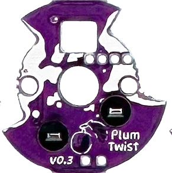

# Cosmos Keyboard PCBs

This repository contains the sources and specs for the PCBs I've made for my pet project, [Cosmos Keyboard Generator](https://ryanis.cool/cosmos).

## Plum Twist

A single-key PCB, with hotswap and RGB support that locks into place. [[Main Website](https://ryanis.cool/cosmos/plum-twist/)] [[Buy](https://cosmos-store.ryanis.cool/products/plum-twist)]

It's similar in functionality to the [Amoeba PCBs](https://github.com/JKing-B16/keyboard-pcbs) (in fact I've used some of the same footprints), but I've switched to large SMD pads to make wiring easier and designed the footprint to twist into a custom socket.

The version here on GitHub is pared down in terms of artwork and panelization, as my goal here is to make it easy for you to produce your own functionally identical version, not copy 1:1 what I sell. It's cheaper through JLC to buy the non-panelized version anyways. See the [subfolder's README](./plum-twist/README.md) for instructions on manufacturing these yourself.

Pinouts and wiring instructions are [on the Plum Twist website](https://ryanis.cool/cosmos/plum-twist/wiring). *A choc version is sadly impossible because the choc hotswap socket is too large to enable twisting while keeping the PCB footprint small.*

## Lemon Microcontroller

A work-in-progress RP2040 microcontroller with 2 spec-compliant USB ports, a VIK connector, and FPC connectors for connecting keys.

The rightmost USB (closest to the RP2040 chip) is for programming. The leftmost PCB (by the SPI flash) cannot be used for programming. See the [subfolder's README](./lemon-microcontroller/README.md) for pinouts, QMK examples, and more.

## Lemon Wireless Microcontroller

A work-in-progress NRF52840 microcontroller with a USB port, battery connector & charger, on/off switch, a VIK connector, and FPC connectors for connecting keys.

See the [subfolder's README](./lemon-wireless-uc/README.md) for more information.

## Licensing

I license the subprojects differently, so refer to each subdirectory for licensing information.
