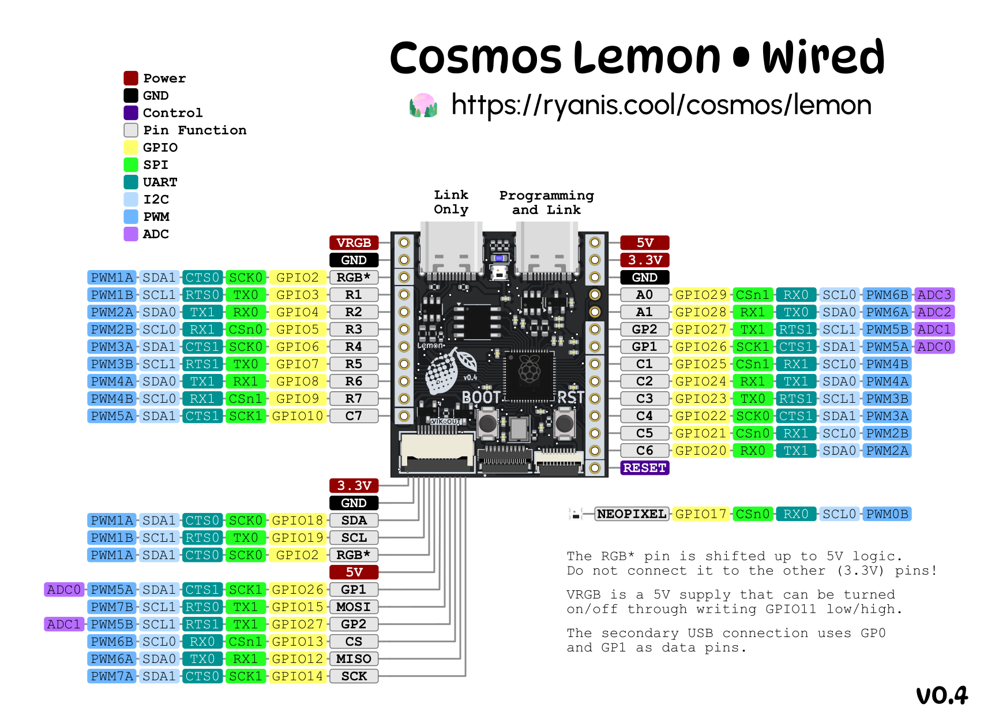

# Lemon Microcontroller

[Documentation is on the Cosmos Docs.](https://ryanis.cool/cosmos/docs/pcbs/lemon-wired/)

## Pinouts

### V0.0 Pinouts
```
Secondary USB pins: GP0 (D+) and GP1 (D-)
Column pins: GP11, GP24, GP23, GP22, GP21, GP20, GP7
Row pins: GP10, GP6, GP9, GP4, GP8, GP5, GP3
LED pin: GP25
VIK SPI: GP12 (RX), GP13 (CS), GP13 (SCK), GP15 (TX). Uses SPI1.
VIK I2C: GP18 (SDA0, GP19 (SCL). Uses I2C 1.
Onboard neopixel: GP17
```

**Notes for v0.0**: Due to an error in routing, GP25 and GP11 got are in the wrong spot in the FPC connector (FPC1) to be compatible with the Skree PCBs. This is why they are swapped in the pinout and don't match the schematic. The reset button didn't get wired in the PCB, so to upload you need to hold down BOOT while plugging in the microcontroller.

### V0.2 Pinouts

```
Secondary USB pins: GP0 (D+) and GP1 (D-)
Column pins: GP25, GP24, GP23, GP22, GP21, GP20, GP7
Row pins: GP10, GP6, GP9, GP4, GP8, GP5, GP3
LED data pin: GP2
LED power pin: GP11 (active low)
VIK SPI: GP12 (RX), GP13 (CS), GP13 (SCK), GP15 (TX). Uses SPI1.
VIK I2C: GP18 (SDA0, GP19 (SCL). Uses I2C 1.
VIK GPIO: GP16 (1st, digital only), GP26 (2nd, has ADC)
Onboard neopixel: GP17
```

### V0.3 Pinouts

[Click for pinout image](./lemon-pcb-pinout-v03.png)

```
Secondary USB pins: GP0 (D+) and GP1 (D-)
Column pins: GP25, GP24, GP23, GP22, GP21, GP20, GP7
Row pins: GP10, GP6, GP9, GP4, GP8, GP5, GP3
LED data pin: GP2
LED power pin: GP11 (active low)
VIK SPI: GP12 (RX), GP13 (CS), GP13 (SCK), GP15 (TX). Uses SPI1.
VIK I2C: GP18 (SDA0, GP19 (SCL). Uses I2C 1.
VIK GPIO: GP26, GP27 (both have ADC)
Onboard neopixel: GP17
```

In V0.3, the LED data pin (5V logic) is broken out as a pad in place of GP2 (3.3V logic).

### V0.4 Pinouts



```
Secondary USB pins: GP0 (D+) and GP1 (D-)
Column pins: GP25, GP24, GP23, GP22, GP21, GP20, GP10
Row pins: GP3, GP4, GP5, GP6, GP7, GP8, GP9
LED data pin: GP2
LED power pin: GP11 (active low)
VIK SPI: GP12 (RX), GP13 (CS), GP13 (SCK), GP15 (TX). Uses SPI1.
VIK I2C: GP18 (SDA0, GP19 (SCL). Uses I2C 1.
VIK GPIO: GP26, GP27 (both have ADC)
Onboard neopixel: GP17
```

I rearranged the row/column pin order in this one to help with handwiring.

## VIK Information

| Category                 | Classification          | Response           |
| -----------------------  | ----------------------- | ------------------ |
| FPC connector            | Required                | :heavy_check_mark: |
| Breakout pins            | Recommended             | :heavy_check_mark: |
| Supplies: SPI            | Required                | :heavy_check_mark: |
| Supplies: I2C            | Required                | :heavy_check_mark: |
| I2C on main PCB          | Discouraged             | no                 |
| I2C pull ups             | Informative             | N/A                |
| Supplies: RGB            | Required                | :heavy_check_mark: |
| Supplies: Extra GPIO 1   | Required                | Analog/Digital     |
| Supplies: Extra GPIO 2   | Required                | Analog/Digital     |

Voltage, SPI & I2C should be fully VIK-compatible. RGB can be used on one of the flex PCB connector, through-hole pad, or VIK module, but not multiple at the same time. This is a limitation of the flex PCB not having an RGB return pin. If you are using RGB through the VIK connector, solder the "RGB->VIK" jumper.

## Testing USB & LED

If you want to have some fun, install Arduino and then from Arduino IDE install the Adafruit TinyUSB and Adafruit NeoPixel libraries. Set your board to `Generic RP2040`, set `Tools -> CPU Speed` to `120 MHz`, and upload the `lemon_test` sketch in this repository. With the serial monitor open, you should see information printed when you plug in/out devices to the secondary USB port. The RGB LED will also slowly fade through colors.

Alternatively, you can upload `File -> Examples -> Adafruit TinyUSB Library -> DualRole -> Simple -> device_info`, which will only test USB. I based `lemon_test` off of this code.

## QMK examples

This is out of date. Refer to the documentation on the Cosmos site for the latest on firmware.

~~I've uploaded a simple QMK example with the correct wiring for the microcontroller. It uses the full 7x7 matrix, so it's great for testing that everything works. I haven't gotten to making the split work correctly though. For that you need to reference https://github.com/sekigon-gonnoc/qmk_firmware/tree/rp2040/keyboards/pico_pico_usb.~~

~~To use it copy `lemon-microcontroller/lemon7x7-qmk-v0` to `<qmk_firmware>/keyboards/cosmos/lemon7x7` then run `qmk flash -j4 -kb cosmos/lemon7x7 -km via -bl uf2-split-right`.~~

~~If you received your Lemon from me, it's probably already running this program.~~

## License

Cosmos Keyboards invests time and resources providing this open source design, please support Cosmos and open-source hardware by purchasing products from Cosmos!

Designed by Ryan Adolf/rianadon for Cosmos Keyboards.

Creative Commons Attribution/Share-Alike, all text above must be included in any redistribution. See license.txt for additional details.

*adapted from Adafruit's Creative Commons Attribution/Share-Alike license.*
