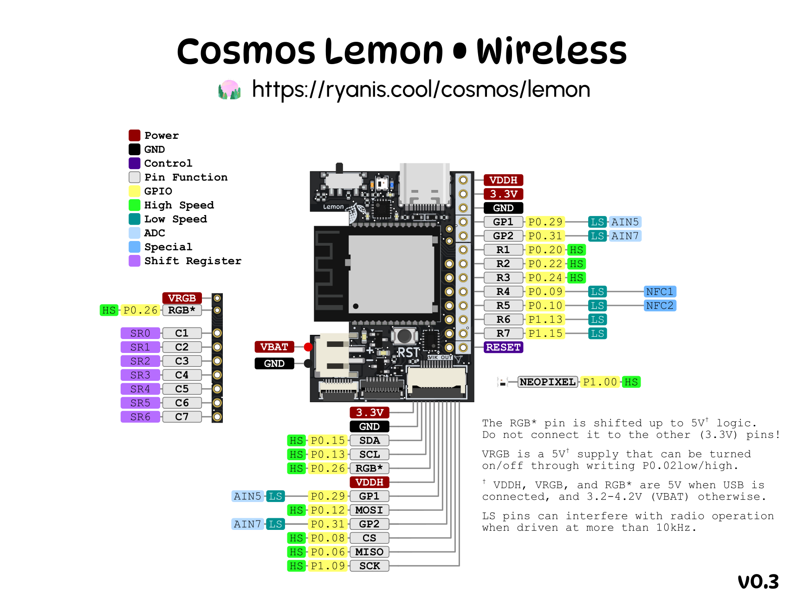

# Lemon Wireless Microcontroller

[Documentation is on the Cosmos Docs.](https://ryanis.cool/cosmos/docs/pcbs/lemon-wireless/)

## Pinouts

### V0.2 Pinout

[Click for pinout picture](./lemon-pcb-wireless-pinout-v02.png)

### V0.3 Pinout

## VIK Information

*TODO: Post card here when certified*

GPIO and SPI & I2C should be fully VIK-compatible. RGB can be used on one of the flex PCB connector or VIK module, but not multiple at the same time. This is a limitation of the flex PCB not having an RGB return pin. If you are using RGB through the VIK connector, solder the "RGB->VIK" jumper.

When connected to USB, 5V on the VIK connector will be 5V. However, it will be equal to battery voltage when operating off battery power (3.3-4.2V).

## License

Cosmos Keyboards invests time and resources providing this open source design, please support Cosmos and open-source hardware by purchasing products from Cosmos!

Designed by Ryan Adolf/rianadon for Cosmos Keyboards.

Creative Commons Attribution/Share-Alike, all text above must be included in any redistribution. See license.txt for additional details.

*adapted from Adafruit's Creative Commons Attribution/Share-Alike license.*
